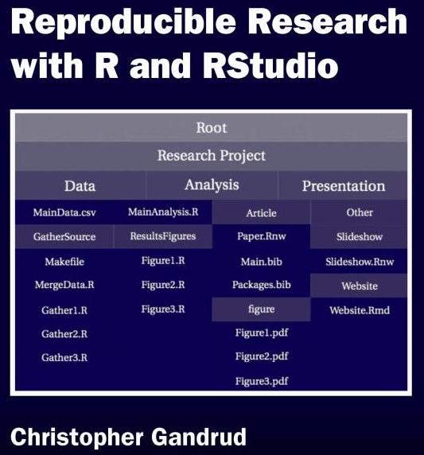

## Rmarkdown
# syntax 
* headings
* font
* equations
* inserting images
* R code
** options

# programming fundamentals
* R refresher
* data structures
** array
** list
** dataframe
* constrol structures
** looping
** apply sequence
* writing functions

# assigments

Given a climate data set, read it in to R, write functions to do the following - find wettest and driest years, find wettest and driest springs, order years by winter temperatures, summer temperatures, use these functions to assess whether or not there is a relationships between precipitation and temperature for different seasons - in clude plotting in your relationship and summarize conclusions plot relationships between annual precipitation and spring, summer and winter temperature - summarize results - is
Summarize results in an R markdown document


# Rmarkdown

## Inspiration {.flexbox .vcenter}

<div align="center">

</div>

Gandrud (2013) [Reproducible Research with R and Rstudio](http://christophergandrud.github.io/RepResR-RStudio/)

## What is Rmarkdown?

Rmarkdown = R + markdown

- _**input**_ simple text:
    - **markdown**: simple formatting of text (bold, links, headers, images, ...)
    - **R**: execute chunks of code (figures, tables...)
    
- _**output**_ various formats:
    - **html**: share on public website
    - **pdf**: polished publication
    - **docx**: share with co-authors to track changes


## Create a R markdown file

In RStudio, to menu File > New File > Rmarkdown... 

Document, HTML. Knit HMTL button to render the right.


## Markdown

"easy" HTML
## Imbed Images

<div align="center">

</div>


Github renders (with [flavor](https://help.github.com/articles/github-flavored-markdown)), eg README.md

## R in Rmarkdown - Chunk

Surround code with 3 backticks with `{r}` in first line

<div align="center">

</div>

## R in Rmarkdown - Inline

Surround code in single backticks

``pi=`r '\x60r pi\x60'` `` evaluates to "pi=`r pi`"

## Equations in Rmarkdown - Chunk

Uses [Latex](https://en.wikibooks.org/wiki/LaTeX) markup language for equations as input. Outputs using [MathJax](https://www.mathjax.org/) JavaScript library for HTML output, native for PDF.

```
$$
\frac{1}{n} \sum_{i=i}^{n} x_{i}
$$
```

$$
\frac{1}{n} \sum_{i=i}^{n} x_{i}
$$

## Equations in Rmarkdown - Inline

  ```
  The Arithmetic mean is equal to $\frac{1}{n} \sum_{i=i}^{n} x_{i}$, or the summation of n numbers divided by n.
  ```

The Arithmetic mean is equal to $\frac{1}{n} \sum_{i=i}^{n} x_{i}$, or the summation of n numbers divided by n.


## Github Friendly

- Rmarkdown (\*.Rmd) renders as markdown (*.md)
  
- easy to see change in simple text files (vs binary / proprietary formats)


## Including Plots

You can also embed plots, for example:

```{r pressure, echo=FALSE}


cc = function(gmax=0.5, LAI=3, b=0.5, optT=24, Tair) {
  
  airm = exp(-b*(Tair-optT))
  cc = gmax * LAI * airm
  cc
}
cc(Tair=24)

optT = seq(from=15,to=24)
T = seq(from=1, to=20, by=0.5)

cc(gmax=0.5, LAI=3, optT=24, Tair=T)

res=data.frame(Tair=T)
res$cc = cc(gmax=0.5, LAI=3, Tair=res$Tair)
plot(res$Tair, res$cc, ylab="Conductance (m/s)",xlab="Air Temperature (C)")

```

Note that the `echo = FALSE` parameter was added to the code chunk to prevent printing of the R code that generated the plot.

## Help

- Rstudio menu Help > [Markdown Quick Reference](http://rmarkdown.rstudio.com/authoring_basics.html)
- [R Markdown Cheat Sheet](../refs/cheatsheets/rmarkdown-cheatsheet.pdf)
- [R Markdown Reference Guide](../refs/cheatsheets/rmarkdown-reference.pdf)
- [Mastering Markdown · GitHub Guides](https://guides.github.com/features/mastering-markdown/)

## Further Resources

- [rmarkdown.rstudio.com](http://rmarkdown.rstudio.com/): authoritative reference site
- [bbest/rmarkdown-example](https://github.com/bbest/rmarkdown-example): example of full manuscript (figures, tables, captions, references using Zotero) as html, pdf, docx
